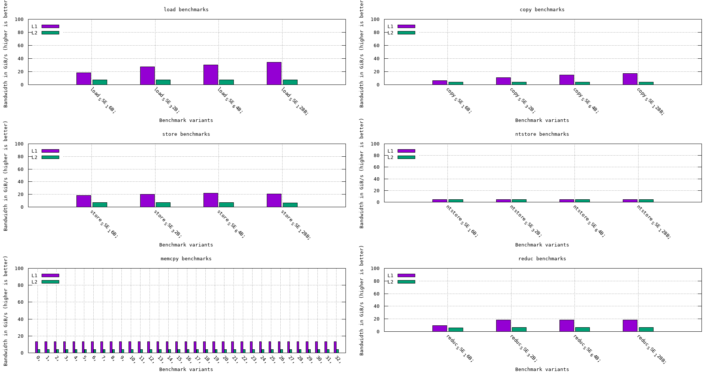

# ASM benchmarks
 Benchmarks on SIMD instructions : SSE, AVX, AVX512



 The benchmarks are in the following folders:
 - copy
 - dotprod
 - load
 - memcpy
 - ntstore
 - pc
 - reduc
 - store
 - triad

 Benchmark code is courtesy of @Yaspr.

# Run benchmarks

```
script.sh
```

# Notes
- Added some compile time to check if machine has AVX and FMA set instructions
- Don't run `pc` executable if you don't have AVX set instructions; unlike other benchmarks, pc only uses AVX
